Spring框架主要的优势是在**简化开发**和**框架整合**上，针对特点Spring的学习主线就是IOC、AOP、声明式事务和整合MyBais框架。Part1主要学习IOC容器中的bean、依赖注入以及核心容器。

<!--more-->

# Spring中的IOC容器

## Spring相关概念

### 初识Spring

在 [Spring官网 ](https://spring.io/)中提供了所有项目统称为Spring全家桶，我们主要需要掌握以下比较流行的技术：

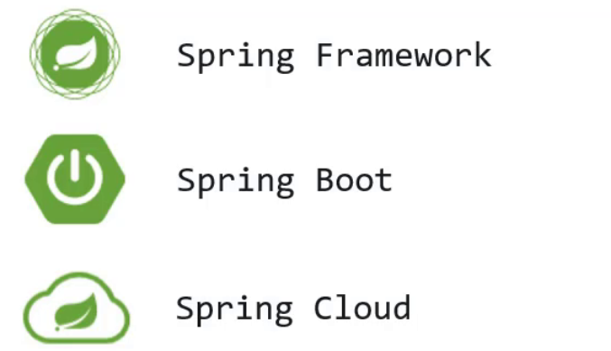

* Spring Framework：Spring框架，是Spring中最早最核心的技术，也是所有其他技术的基础。
* SpringBoot：Spring是来简化开发，而SpringBoot是来帮助Spring在简化的基础上能更快速进行开发。
* SpringCloud：这个是用来做分布式微服务架构的相关开发。

### Spring系统架构（3）

至今Spring已经更新到6.x版本，而下面的是4.x版本的架构图。Spring Framework 的系统架构图只是一种概念上的表示，具体实现和细节可能会根据具体应用场景进行调整和优化，所以我们以4.x版本为例来研究。

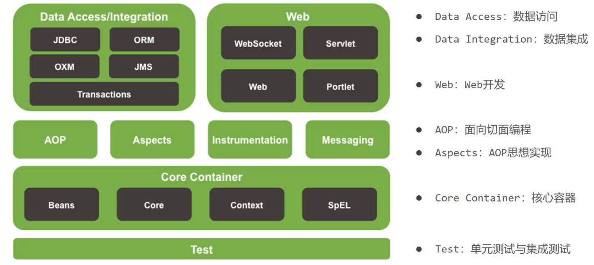

（1）核心层

+ Core Container：核心容器，这个模块是Spring最核心的模块，其他的都需要依赖该模块；

（2）AOP层

* AOP：面向切面编程，它依赖核心层容器，目的是在不改变原有代码的前提下对其进行功能增强；
* Aspects：AOP是思想，Aspects是对AOP思想的具体实现；

（3）数据层

* Data Access：数据访问，Spring全家桶中有对数据访问的具体实现技术；
* Data Integration：数据集成，Spring支持整合其他的数据层解决方案，比如Mybatis；
* Transactions：事务，Spring中事务管理是Spring AOP的一个具体实现，也是后期学习的重点内容；

（4）Web层

* 这一层的内容将在SpringMVC框架具体学习；

（5）Test层

* Spring主要整合了Junit来完成单元测试和集成测试。

### Spring核心概念（3）

这部分内容中主要包含 `IOC/DI` 、`IOC容器` 和 `Bean`。

#### 目前的问题（4）

业务层需要调用数据层的方法，就需要在业务层new数据层的对象；如果数据层的实现类发生变化，那么业务层的代码也需要跟着改变，发生变更后，都需要进行编译打包和重部署，导致项目代码的**耦合度偏高**。

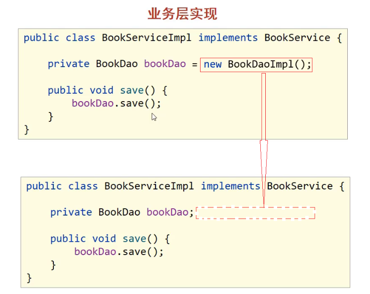

从上图我们也可以看到，业务层是通过new数据层的对象调用数据层的方法，从而造成耦合度高的问题。如果能把框中的内容给去掉，不就可以降低依赖了，但是如果直接去掉不做任何改动，会造成对象的NullPointer报错 。针对这个问题，Spring就提出了一个解决方案：在使用对象时，在程序中不要主动使用new产生对象，转换为由外部提供对象，这种实现思想就是Spring的一个核心概念。

#### IOC、IOC容器、Bean、DI（4）

1、IOC（Inversion of Control）控制反转

（1）控制反转：使用对象时，由主动new产生对象转换为由外部提供对象，此过程中对象创建控制权由程序转移到外部，此思想称为控制反转。

（2）Spring和IOC的关系：Spring提供了一个容器，称为IOC容器，IOC思想中的“提供对象的外部”指的就是Spring的IOC容器。

（3）IOC容器：

* IOC容器负责对象的创建、初始化等一系列工作，其中包含了数据层和业务层的类对象；
* 被创建或被管理的对象在IOC容器中统称为Bean，IOC容器中放的就是一个个的Bean对象；

（4）在IOC容器中创建好service对象和dao对象后，要将service对象建立对dao对象的依赖关系，在容器中建立对象与对象之间的绑定关系就要用到 **DI**。

2、DI（Dependency Injection）依赖注入

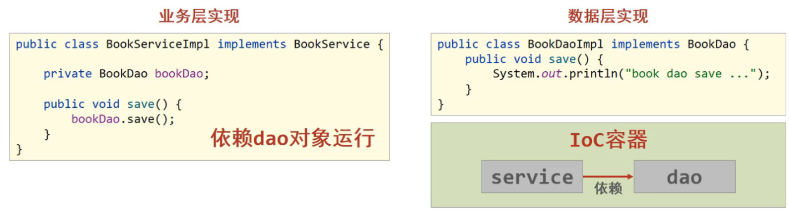

依赖注入：在容器中建立bean与bean之间的依赖关系的整个过程称为依赖注入。如业务层需要依赖数据层，service就要和dao建立依赖关系。

使用`IOC`和`DI`到达最终解耦的目的，最终结果是使用对象可以直接从IOC容器中获取，并且获取到的bean已经绑定了所有的依赖关系。

### IOC、DI入门案例（3）                                        	

 步骤1：在pom.xml导入`spring`依赖坐标；

```xml
    <dependency>
        <groupId>org.springframework</groupId>
        <artifactId>spring-context</artifactId>
        <version>6.0.6</version>
    </dependency>
```

步骤1.5：创建数据层和业务层代码

步骤2：在`resource`目录下创建spring的配置文件——`applicationContext.xml`，配置对应类作为Spring管理的Bean；

```xml
<bean id="userDao" class="com.Lijiacheng.dao.Impl.UserDaoImpl"></bean>
<bean id="userService" class="com.Lijiacheng.service.Impl.UserServiceImpl"></bean>
```

> Bean定义时，id属性在同一个配置文件中不能重复。

步骤3：使用Spring提供的接口`ApplicationContext`完成IOC容器的创建；

```java
ApplicationContext ctx = new ClassPathXmlApplicationContext("applicationContext.xml");
```

步骤4：从IOC容器中获取对象进行方法调用；

```java
    UserDao userDao = (UserDao) ctx.getBean("userDao");
    userDao.save();
    UserService userService = (UserService) ctx.getBean("userService");
    userService.save();
```

p.s. 标准的项目架构如下：

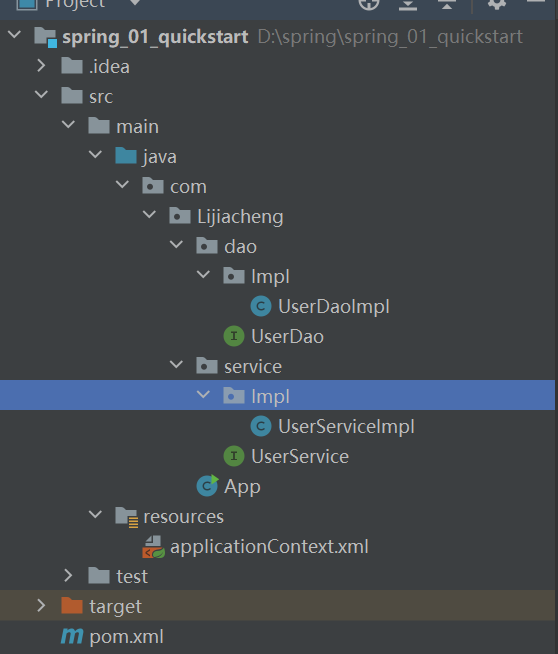

这时候在业务层仍然是用new创建了数据层的`UserDaoImpl`对象，为了实现IOC，还需要用到DI依赖注入。

步骤5：删除业务层中通过new方式创建的dao对象

```java
    // private UserDao userDao = new UserDaoImpl();
    private UserDao userDao;
```

步骤6：提供对应的setter方法*（快捷键：Fn+Alt+Insert）*

```java
    public void setUserDao(UserDao userDao) {
        this.userDao = userDao;
    }
```

因为不再程序中使用new对对象`UserDao`进行赋值操作，所以要为`UserDao`对象提供一个赋值的入口，就是setter方法，什么时候调用，谁来调用它会在后续提到。

步骤7：修改配置完成DI注入

```xml
	<bean id="userDao" class="com.Lijiacheng.dao.Impl.UserDaoImpl"></bean>
    <bean id="userService" class="com.Lijiacheng.service.Impl.UserServiceImpl">
        <!-- 7.配置service与dao的关系-->
        <!--
                property标签表示配置当前的bean属性
                name属性表示配置的是哪一个具体的属性
                ref属性表示参照的是哪一个bean
         -->
         <property name="userDao" ref="userDao"></property>
    </bean>
```

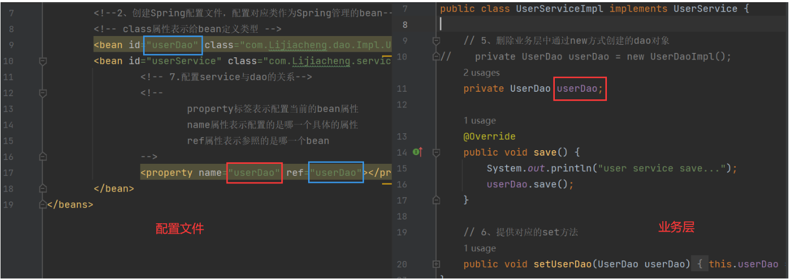

## IOC控制反转（2）

前面的入门案例尝试了bean如何定义配置、DI如何定义配置以及容器对象如何获取，接下来主要是把这三块内容展开进行详细的讲解。

### Bean基础配置（3）

+ Bean基础配置

  ```xml
  <bean id="" class=""/>
  ```

  + id：使用id可以获取对应的bean，在一个容器中id值是唯一的
  + class：bean的类型，配置的bean的全路径类名

+ Bean别名配置：`name`属性

  为bean指定别名，别名可以有多个，可以使用逗号、分号、空格进行分隔。这样从容器中获取bean对象时就可以使用name里的别名了（`ref`属性里指定的bean也可以使用别名，但正规写法是使用id属性）。

  > 如果抛出NoSuchBeanDefinitionException的异常，表示从IOC容器中找不到该bean，这时候要去检查配置文件bean中的id属性和name属性，是否和getbean中的参数对应一致。	

+ Bean作用范围配置：`scope`属性

  + `singleton`：单例（默认）
  + `prototype`：非单例

  将同一个bean获取两次，打印看地址输出是否一致：

  ```java
  UserDao userDao1 = (UserDao) ctx.getBean("userDao");
  UserDao userDao2 = (UserDao) ctx.getBean("userDao");
  ```

  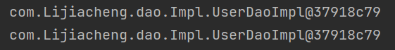

  将`UserDao`这个bean配置为非单例模式：

  ```xml
  <bean id="userDao" class="com.Lijiacheng.dao.Impl.UserDaoImpl" scope="prototype"></bean>
  ```

  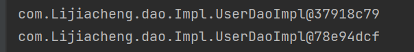

  > ① bean默认为单例是在Spring的IOC容器中只会有该类的一个对象，避免了对象的频繁创建与销毁，达到了bean对象的复用，性能高。
  >
  > ② 单例模式的bean：如果对象是有状态对象，即该对象有成员变量可以用来存储数据的；因为所有请求线程共用一个bean对象，所以会存在线程安全问题。反之则不存在线程安全问题。
  >
  > ③ 像表现层、业务层、数据层、工具类对象，这样的bean对象适合交给容器进行管理，它们在单例模式下不会存在线程安全问题，且对bean对象进行复用；而示例对象则不适合交给容器进行管理。

### Bean实例化（3）

现在bean已经放在了IOC容器中，那容器是如何进行bean的创建的呢？bean本质上是对象，通过new创建对象是调用类的构造方法，所以创建bean也是通过构造方法来完成的。

#### 构造方法实例化（4）

在`UserDaoImpl`类中创建一个无参构造方法：

```java
public UserDaoImpl() {
    System.out.println("userDaoImpl Constructor is running...");
}
```

控制台有打印构造函数中的输出，说明Spring容器在创建对象的时候也走的是构造函数：


每一个类默认都会提供一个无参构造函数，所以其实真正在使用这种方式的时候，我们什么也不需要做，这也是我们以后比较常用的一种方式。

#### 静态工厂实例化（4）

1、工厂方式创建bean

（1）准备一个OrderDao和OrderDaoImpl类

（2）创建一个工厂类OrderDaoFactory并提供一个静态方法

```java
    public class OrderDaoFactory {
        public static OrderDao getOrderDao(){
            return new OrderDaoImpl();
        }
    }
```

（3）编写AppForInstanceOrder运行类，在类中通过工厂获取对象

2、静态工厂实例化

现在bean对象已经创建好了，如何将bean交给Spring来管理呢？

（1）在spring的配置文件applicationContext.properties中添加以下内容：

```xml
<bean id="orderDao" class="com.Lijiacheng.dao.OrderDaoFactory" factory-method="getOrderDao"></bean>
```

+ class：工厂类的类全名；
+ factory-mehod：具体工厂类中创建对象的方法名；

（2）在AppForInstanceOrder运行类，使用从IOC容器中获取bean的方法进行运行测试（跟前面一致）。

> 这种方式一般是用来兼容早期的一些老系统，过去使用工厂类创建对象，是为了在new基础上添加一些其他的业务内容。

#### 实例工厂与FactoryBean（4）

1、实例工厂方式创建bean

（1）准备一个BookDao和BookDaoImpl类

（2）创建一个工厂类OrderDaoFactory并提供一个普通方法（注意此处和静态工厂的工厂类不同之处是方法不是静态方法）

（3）编写AppForInstanceBook运行类，在类中通过工厂获取对象

2、实例工厂实例化

（1）在spring的配置文件中添加以下内容：

```xml
<bean id="bookFactory" class="com.Lijiacheng.dao.factory.BookDaoFactory"></bean>
<bean id="bookDao" factory-bean="bookFactory" factory-method="getBookDao"></bean>
```

实例化工厂的运行顺序：

+ 创建实例化工厂对象，对应的是第一行配置；

+ 调用对象中的方法来创建bean，对应的是第二行配置：

  * factory-bean：工厂的实例对象（对应bean的id属性）

  * factory-method：工厂对象中的具体创建对象的方法名，对应关系如下:

    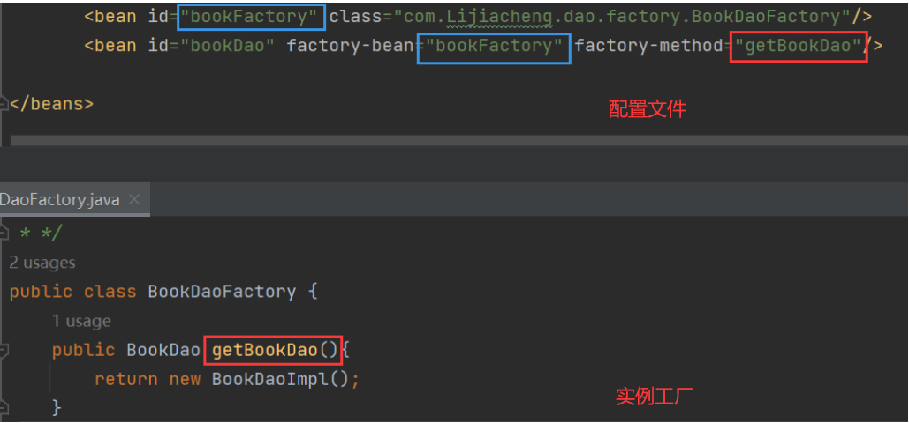

（2）在AppForInstanceUser运行类，使用从IOC容器中获取bean的方法进行运行测试。

3、FactoryBean

Spring为了简化实例工厂进行bean实例化的配置方式就提供了`FactoryBean`来简化开发。

（1）创建一个BookDaoFactoryBean的类，实现`FactoryBean`接口，重写接口的方法：

```java
    public class BookDaoFactoryBean implements FactoryBean<BookDao> {
        //代替原始实例工厂中创建对象的方法
        @Override
        public BookDao getObject() throws Exception {
            return new BookDaoImpl();
        }
        //返回所创建类的Class对象
        @Override
        public Class<?> getObjectType() {
            return BookDao.class;
        }
    }
```

> 在`FactoryBean`接口中还有一个方法，默认是不需要重写的，就是`isSingleton()`，默认是单例模式`return true`.

（2）在Spring的配置文件中进行配置

```xml
<bean id="bookDao" class="com.Lijiacheng.dao.factory.BookDaoFactoryBean"/>
```

**Bean实例化 小结**

+ bean本质是对象，所以它是通过构造方法来创建的；
+ Spring的IOC实例化对象的三种方式分别是：构造方法、静态工厂、实例工厂，这些方式中主要掌握构造方法和实例工厂中的`FactoryBean`方法即可；
+ 在使用构造方法实例化对象时，如果重写了构造方法，建议把无参默认构造方法也重写。

### Bean的生命周期（4）

bean的生命周期就是bean对象从创建到销毁的整体过程。

#### 生命周期设置（4）

* bean创建之后添加内容，比如用来初始化需要用到资源
* bean销毁之前添加内容，比如用来释放用到的资源

1、在配置文件添加method方式进行生命周期设置

**步骤1：**添加初始化和销毁的方法（方法名任意）

**步骤2：**配置生命周期

在配置文件中添加如下配置：

```xml
<bean id="userDao" class="com.Lijiacheng.dao.Impl.UserDaoImpl" init-method="init" destroy-method="destroy"/>
```

从执行结果来看，init方法执行了，但destroy方法没有执行。

> 因为Spring的IOC容器是运行在JVM中，运行main方法后，JVM启动，Spring加载配置文件生成IOC容器，从容器获取bean对象，然后调方法执行main方法执行完后，JVM退出，这个时候IOC容器中的bean还没有来得及销毁就已经结束了，所以没有调用对应的destroy方法。

所以我们需要手动关闭容器来销毁bean。

+ 方式1：close关闭容器

  ApplicationContext中没有close方法，需要把ApplicationContext换成它是实现类ClassPathXmlApplicationContext，再调用`close()`方法即可。

+ 方式2：注册钩子关闭容器

  提前设置好回调函数，让JVM在退出之前回调此函数来关闭容器。

  ```java
  ctx.registerShutdownHook();  // JVM退出前调用关闭，可以放在任意位置
  ```

2、实现接口方式进行生命周期设置

添加初始化和销毁方法，既需要编码也需要配置，实现起来步骤比较多也比较乱，Spring提供了两个接口来完成生命周期的控制，好处是可以不用再进行配置`init-method`和`destroy-method`。

修改UserServiceImpl类，添加两个接口`InitializingBean`， `DisposableBean`并实现接口中的两个方法`afterPropertiesSet`和`destroy`.

```java
	@Override
    public void destroy() throws Exception {
        System.out.println("service destroy");
    }

    @Override
    public void afterPropertiesSet() throws Exception {
        System.out.println("service init");
    }
```

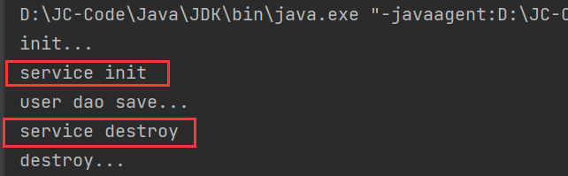

> Bean的声明周期和是否`getBean`没有关系，bean随着加载配置文件生成IOC容器而被创建出来，随着IOC的关闭而销毁。

对于业务层的UserServiceImpl来说，userDao是它的一个属性，setUserDao方法是Spring的IOC容器为其注入属性的方法：

```xml
<property name="userDao" ref="userDao"></property>  <!-- setter为其注入name属性 -->
```

而`afterPropertiesSet()`意为”属性创建之后“，所以bean的初始化方法会在类中属性设置之后执行。

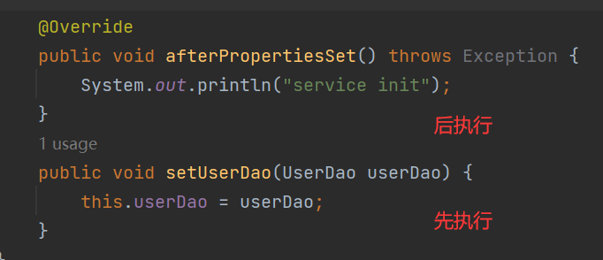

**bean的生命周期 小结**

（1）关于Spring中对bean生命周期控制提供了两种方式：

* 在配置文件中的bean标签中添加`init-method`和`destroy-method`属性；
* 类实现`InitializingBean`与`DisposableBean`接口（了解即可）。

（2）bean的生命周期

* 初始化容器
  * 创建对象（new内存分配）
  * 执行构造方法
  * 执行属性注入（setter操作）
  * 执行bean初始化方法（init操作，生命周期开启）
* 使用bean：执行业务操作
* 关闭/销毁容器：执行bean销毁方法（destroy）

（3）关闭容器的两种方式：

* `close()` 方法
* `registerShutdownHook()` 方法

## DI依赖注入（2）

向一个类中传递数据有2种方式：普通set方法、构造方法；依赖注入描述了在容器中建立bean与bean之间的依赖关系的过程，但有时bean运行需要的是数字或字符串。Spring基于上述为我们提供了2种注入方式：

+ setter注入：引用类型、简单类型（这里将String归类到基本类型的注入中，但实际上String是个类，是引用数据类型）
+ 构造器注入：引用类型、简单类型

### setter注入（3）

#### setter注入引用类型（4）

+ 在bean中声明引用类型属性，并提供可访问的set方法

  ```java
  private UserDao userDao;
  private BookDao bookDao;
  public void setUserDao(UserDao userDao) {
      this.userDao = userDao;
  }
  public void setBookDao(BookDao bookDao) {
      this.bookDao = bookDao;
  }
  ```

+ 配置中使用`property`标签`ref`属性注入引用类型对象

  ```xml
  <bean id="userDao" class="com.Lijiacheng.dao.Impl.UserDaoImpl"/>
  <bean id="bookDao" class="com.Lijiacheng.dao.Impl.BookDaoImpl"/>
  <bean id="userService" class="com.Lijiacheng.service.Impl.UserServiceImpl">
      <property name="userDao" ref="userDao"></property>
      <property name="bookDao" ref="bookDao"></property>
  </bean>
  ```

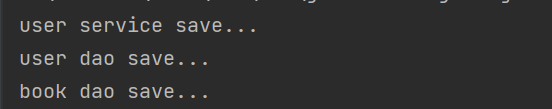

现在userDao、userService、bookDao对象都已经被注入成功。

#### setter注入简单类型（4）

+ 在bean中声明简单类型属性，并提供可访问的set方法

  ```java
  private String databaseName;  // 注入时把String看作简单类型
  private int connectionNum;
  public void setDatabaseName(String databaseName) {
      this.databaseName = databaseName;
  }
  public void setConnectionNum(int connectionNum) {
      this.connectionNum = connectionNum;
  }
  ```

+ 配置中使用`property`标签注入简单类型对象

  ```xml
  <bean id="userDao" class="com.Lijiacheng.dao.Impl.UserDaoImpl">
      <property name="databaseName" value="mysql"></property>
      <property name="connectionNum" value="10"></property>
  </bean>
  ```

  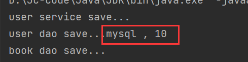

### 构造器注入（3）

#### 构造器注入引用数据类型（4）

+ 删除属性的setter方法并提供构造方法

  ```java
  private UserDao userDao;
  public UserServiceImpl(UserDao userDao) {
      this.userDao = userDao;
  }
  ```

+ 配置中使用`constructor-arg`标签注入引用类型对象

  ```xml
  <bean id="userDao" class="com.Lijiacheng.dao.Impl.UserDaoImpl"/>
  <bean id="userService" class="com.Lijiacheng.service.Impl.UserServiceImpl">
      <constructor-arg name="userDao" ref="userDao"></constructor-arg>
  </bean>
  ```

  在`constructor-arg`标签中，name属性对应的值为**构造函数中方法形参**的参数名，必须要保持一致。


#### 构造器注入简单数据类型（4）

+ 删除属性的setter方法并提供构造方法

  ```java
  private String databaseName;
  private int connectionNum;
  public UserDaoImpl(String databaseName, int connectionNum) {
      this.databaseName = databaseName;
      this.connectionNum = connectionNum;
  }
  ```

> 注意：添加完构造方法后在配置文件中出现bean中class属性的报错：
>
> 
>
> 意思是找不到匹配的构造函数，说明在使用构造函数创建bean的时候，默认的无参构造被覆盖了，只要重写一遍无参构造即可。

+ 配置中使用`constructor-arg`标签注入简单类型对象

  ```xml
  <bean id="userDao" class="com.Lijiacheng.dao.Impl.UserDaoImpl">
      <constructor-arg name="connectionNum" value="666"></constructor-arg>
          <constructor-arg name="databaseName" value="mysql"></constructor-arg>
  </bean>
  ```

  

**依赖注入 小结**

+ 强制依赖（强制依赖指对象在创建的过程中必须要注入指定的参数）使用构造器进行；可选依赖（可选依赖指对象在创建过程中注入的参数可有可无）使用setter注入进行，灵活性强。

+ Spring框架倡导使用构造器，第三方框架内部大多数采用构造器注入的形式进行数据初始化，相对严谨；实际开发过程中还要根据实际情况分析，如果受控对象没有提供setter方法就必须使用构造器注入。
+ 自己开发的模块推荐使用setter注入（推荐setter）。

### 依赖自动装配（3）

IoC容器根据bean所依赖的资源在容器中自动查找并注入到bean中的过程称为自动装配，从而简化配置文件的配置编写。

自动装配只需要修改applicationContext.xml配置文件：

```xml
<bean id="userDao" class="com.Lijiacheng.dao.Impl.UserDaoImpl"/>
<!-- autowire属性：开启自动装配，通常使用按类型装配 -->
<bean id="userService" class="com.Lijiacheng.service.Impl.UserServiceImpl" autowire="byType"/>
```

> 使用自动装配需要注意的点：① 需要注入属性的类中对应属性的setter方法不能省略；② 被注入的对象必须要被Spring的IOC容器管理；③ 按照类型装配在Spring的IOC容器中只能有该类型的唯一对象。

一个类型在IOC中有多个对象，还想要注入成功，这个时候就需要按照名称注入：`autowire="byName"`.

**自动装配**

+ 自动装配用于引用类型依赖注入，不能对简单类型进行操作。

+ 使用按类型装配时（byType）必须保障容器中相同类型的bean唯一，推荐使用；使用按名称装配时（byName）必须保障容器中具有指定名称的bean，因变量名与配置耦合，不推荐使用。

+ 自动装配优先级低于setter注入与构造器注入，同时出现时自动装配配置失效。

### 集合注入（3）

前面我们已经能完成引入数据类型和简单数据类型的注入，但是还有一种数据类型集合，集合中既可以装简单数据类型也可以装引用数据类型，在Spring中该如何注入呢？

```java
public class UserDaoImpl implements UserDao {
    private int[] array;
    private List<String> list;
    private Set<String> set;
    private Map<String,String> map;
    private Properties properties;
    public void save() {
       System.out.println("user dao save ...");
       System.out.println("遍历数组:" + Arrays.toString(array));
       System.out.println("遍历List" + list);
       System.out.println("遍历Set" + set);
       System.out.println("遍历Map" + map);
       System.out.println("遍历Properties" + properties);
    }
	//setter....方法省略，自己使用工具生成
}
```

下面的所以配置方式，都是在userDao的bean标签中使用<property>进行注入：

注入数组类型数据：

```xml
<property name="array">
    <array>
        <value>100</value>
        <value>200</value>
        <value>300</value>
    </array>
</property>
```

注入List类型数据：

```xml
<property name="list">
    <list>
        <value>zhongguo</value>
        <value>shandong</value>
        <value>qingdao</value>
    </list>
</property>
```

注入Set类型数据：

```xml
<property name="set">
    <set>
        <value>zhongguo</value>
        <value>shandong</value>
        <value>qingdao</value>
        <value>qingdao</value>
    </set>
</property>
```

注入Map类型数据：

```xml
<property name="map">
    <map>
        <entry key="country" value="china"/>
        <entry key="province" value="henan"/>
        <entry key="city" value="kaifeng"/>
    </map>
</property>
```

注入Properties类型数据：

```xml
<property name="properties">
    <props>
        <prop key="country">china</prop>
        <prop key="province">henan</prop>
        <prop key="city">kaifeng</prop>
    </props>
</property>
```

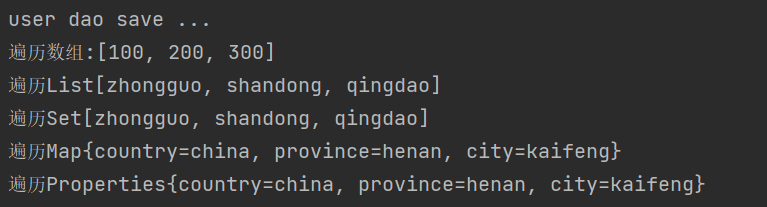

> + property标签表示setter方式注入，构造方式注入constructor-arg标签内部也可以写`<array>`、`<list>`、`<set>`、`<map>`、`<props>`标签
> + List的底层也是通过数组实现的，所以`<list>`和`<array>`标签是可以混用
> + 集合中要添加引用类型，只需要把`<value>`标签改成`<ref>`标签，这种方式用的比较少

## IOC/DI配置管理第三方bean（2）

前面的配置都是基于我们自己写的类，那么该如何管理第三方jar包中的类？

### 数据源对象管理（3）

以后我们会用到很多第三方的bean，下面将使用数据源Druid和C3P0来学习配置。

#### 实现Druid管理（4）

+ 导入最新版的Druid依赖坐标和mysql坐标

  ```xml
  <dependency>
      <groupId>com.alibaba</groupId>
      <artifactId>druid</artifactId>
      <version>1.2.16</version>
  </dependency>
  ```

+ 在配置文件中配置第三方bean

  ```xml
  <!-- 管理Druid对象 -->
      <bean id="dataSource" class="com.alibaba.druid.pool.DruidDataSource">
          <!-- setter配置属性 -->
          <property name="driverClassName" value="com.mysql.cj.jdbc.Driver"/>
          <property name="url" value="jdbc:mysql://localhost:3306/mybatis"/>
          <property name="username" value="root"/>
          <property name="password" value="12345"/>
      </bean>
  ```

> Druid对象通过setter注入依赖，是因为在对象的上层类DruidDataSource中提供了属性的set方法。

+ 从IOC容器中获取对应的bean对象(DruidDataSource)

#### 实现C3P0管理（4）

+ 导入最新版的C3P0坐标和mysql坐标

  ```xml
  <dependency>
      <groupId>com.mchange</groupId>
      <artifactId>c3p0</artifactId>
      <version>0.9.5.5</version>
  </dependency>
  ```

+ 在配置文件中配置第三方bean

  ```xml
  <!-- 管理c3p0对象 -->
      <bean id="dataSource" class="com.mchange.v2.c3p0.ComboPooledDataSource">
          <property name="driverClass" value="com.mysql.cj.jdbc.Driver"/>
          <property name="jdbcUrl" value="jdbc:mysql://localhost:3306/mybatis"/>
          <property name="user" value="root"/>
          <property name="password" value="12345"/>
          <property name="maxPoolSize" value="1000"/>
      </bean>
  ```

> Druid和C3P0在没有导入mysql驱动包的前提下虽然没有报错，说明在初始化的时候没有去加载驱动，但是在获取数据库连接的时候，也会报找不到驱动类的错误，所以在导入依赖坐标的时候除了导入数据库连接池的坐标外还要导入mysql的坐标。

### 加载properties文件（3）

这两个数据源中都使用到了一些固定的常量如数据库连接四要素，把这些值写在Spring的配置文件中不利于后期维护，需要将这些值提取到一个外部的properties配置文件，spring来加载配置信息并使用这些信息来完成属性注入。

+ resources下创建一个`jdbc.properties`文件（名字任意），并添加对应的属性键值对：

  ```properties
  jdbc.driver=com.mysql.cj.jdbc.Driver
  jdbc.url=jdbc:mysql://127.0.0.1:3306/mybatis
  jdbc.username=root
  jdbc.password=12345
  ```

+ 开启 `context` 命名空间

  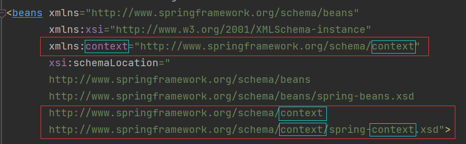

  直接copy配置文件中bean的命名空间并修改这5处为：`context`即可。

+ 加载properties配置文件

  ```xml
  <!-- 使用context命名空间下的标签来加载properties配置文件 -->
  <context:property-placeholder location="jdbc.properties"/>
  ```

+ 完成属性注入

  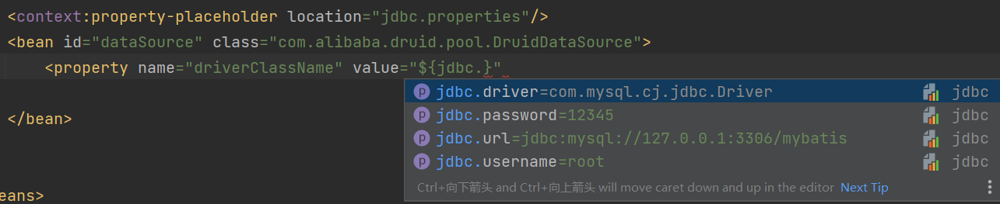

  ```xml
  <bean id="dataSource" class="com.alibaba.druid.pool.DruidDataSource">
      <property name="driverClassName" value="${jdbc.driver}"/>
      <property name="url" value="${jdbc.url}"/>
      <property name="username" value="${jdbc.username}"/>
      <property name="password" value="${jdbc.password}"/>
  </bean>
  ```

> `<context:property-placeholder/>`标签会加载系统的环境变量，而且环境变量的值会被优先加载，可以在该标签上增添属性`system-properties-mode="NEVER"`避免加载系统环境变量。

**加载多个properties文件**

```xml
<!--方式一 -->
<context:property-placeholder location="jdbc.properties,jdbc2.properties" system-properties-mode="NEVER"/>
<!--方式二-->
<context:property-placeholder location="*.properties" system-properties-mode="NEVER"/>
<!--方式三 -->
<context:property-placeholder location="classpath:*.properties" system-properties-mode="NEVER"/>
<!--方式四-->
<context:property-placeholder location="classpath*:*.properties" system-properties-mode="NEVER"/>
```

方式三是标准的写法，`classpath:`代表的是从根路径下开始查找，但是只能查询当前项目的根路径；方式四不仅可以加载当前项目还可以加载当前项目所依赖的所有项目的根路径下的properties配置文件。

## 核心容器（2）

讲完bean与依赖注入，接下来我们主要学习的是IOC容器中的核心容器。

### 容器（3）

#### 创建核心容器（4）

+ 类路径下的XML配置文件

  ```xml
  ApplicationContext ctx = new ClassPathXmlApplicationContext("applicationContext.xml");
  ```

+ 文件系统下的XML配置文件（从项目路径下开始查找，不推荐使用）

  ```xml
  ApplicationContext ctx = new FileSystemXmlApplicationContext("applicationContext.xml的绝对路径");
  ```

#### 获取Bean的三种方式（4）

+ 方式1：每次获取的时候都需要进行类型转换

  ```java
  UserDao userDao = (UserDao) ctx.getBean("UserDao");
  ```

+ 方式2：可以解决类型强转问题，但是加了一个参数

  ```java
  UserDao userDao = ctx.getBean("UserDao"，BookDao.class);
  ```

+ 方式3：按class类型获取bean，必须要确保IOC容器中该类型对应的bean对象只能有一个

  ```java
  BookDao bookDao = ctx.getBean(BookDao.class);
  ```

#### BeanFactory（4）

容器的最上级的父接口为`BeanFactory`，可以使用BeanFactory来创建IOC容器。

BeanFactory是延迟加载，只有在获取bean对象的时候才会去创建；ApplicationContext是立即加载，容器加载的时候就会创建bean对象。ApplicationContext要想成为延迟加载，只需要在配置文件中配置`lazy-init="true"`。

### 核心容器总结（3）

**容器**

- BeanFactory是IoC容器的顶层接口，初始化BeanFactory对象时，加载的bean延迟加载；ApplicationContext接口是Spring容器的核心接口，初始化时bean立即加载。
- ApplicationContext接口提供基础的bean操作相关方法，通过其他接口扩展其功能
- ApplicationContext接口常用初始化类：`ClassPathXmlApplicationContext`

**bean**

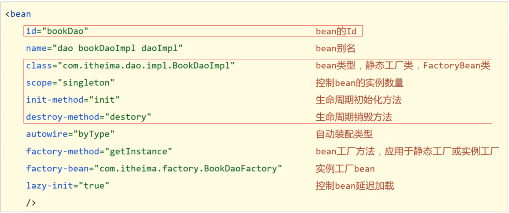

整个配置最常用的就两个属性：`id`和`class`。

**依赖注入**

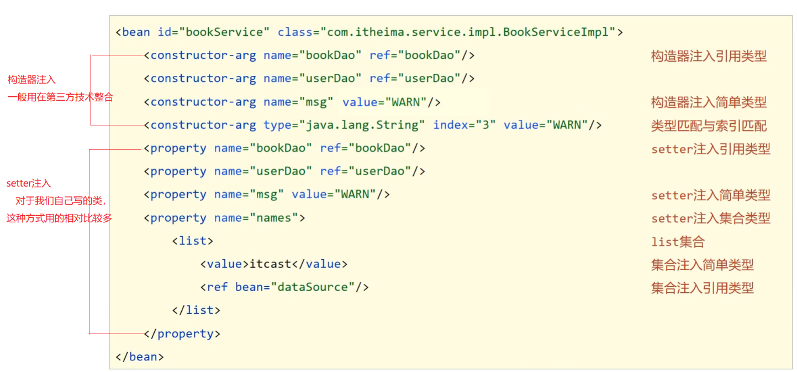