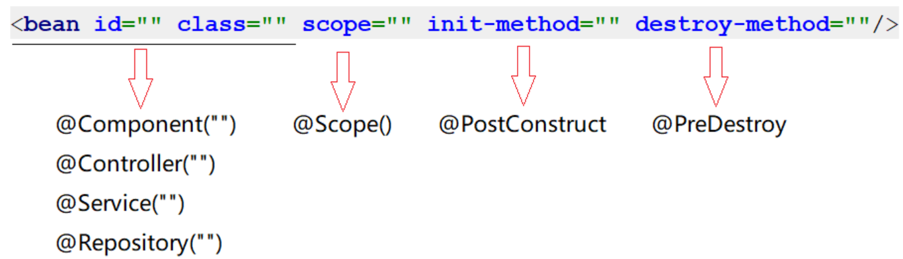
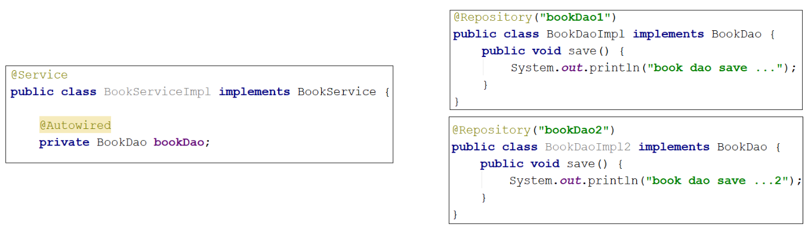
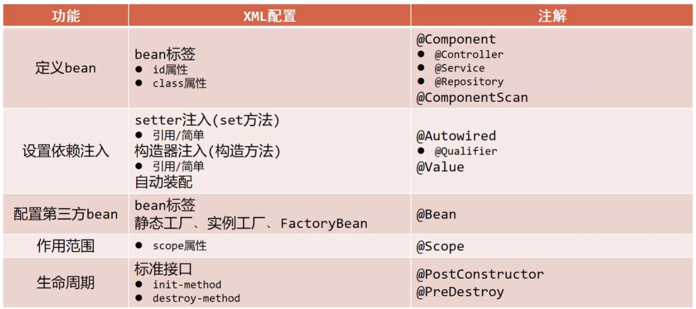

Part1记录了关于IOC/DI的配置开发，但是使用起来相对来说还是比较复杂的，要想真正简化开发，就需要用到Spring的注解开发。

<!--more-->

# Spring注解开发

关于Spring的注解开发，从Spring2.0开始支持注解，Spring3.0已经支持纯注解开发。关于注解开发，主要学习两块内容：注解开发定义bean和纯注解开发。

## IOC/DI注解开发（2）

使用注解开发，也就意味着我们需要通过注解的方式，来取代Spring配置文件中的内容。

### 注解开发定义bean（3）

注解定义bean和纯注解开发是有本质区别的，后者完全摒弃了Spring配置文件，而注解定义bean还需要配置文件来做一些工作（包扫描）。

+ 步骤1：配置Spring的注解包扫描

  为了让Spring框架能够扫描到写在类上的注解，需要在配置文件上进行包扫描（在配置文件中定义`context`的命名空间）。

  ```xml
  <context:component-scan base-package="com.Lijiacheng"/>
  ```

+ 步骤2：在Dao类和Service类上添加`@Component`注解

  ```java
  @Component("userDao")
  public class UserDaoImpl implements UserDao {
      public void save(){
          System.out.println("user dao save...");
      }
  }
  @Component
  public class UserServiceImpl implements UserService{
      private UserDao userDao;
      public void setUserDao(UserDao userDao) {
          this.userDao = userDao;
      }
      @Override
      public void save() {
          System.out.println("book service save ...");
          userDao.save();
      }
  }
  ```

  一行注解取代了在配置文件中通过`<bean>`中的`id`和`class`属性定义bean。

  > @Component注解不可以添加在接口上，因为接口是无法创建对象的。

+ 步骤3：在App类中，从IOC容器中获取对应的bean对象

  ```java
  ApplicationContext ctx = new ClassPathXmlApplicationContext("applicationContext.xml");
  UserDao userDao = (UserDao) ctx.getBean("userDao");
  System.out.println(userDao);
  UserServiceImpl userService = ctx.getBean(UserServiceImpl.class);  // 按类型获取bean
  System.out.println(userService);
  ```

  `@Component`注解如果不起名称，要么通过类型获取bean；要么有一个默认值就是当前类名首字母小写，所以也可以按照名称获取。

**@Component的作用是设置该类为spring管理的bean。**对于@Component注解，还衍生出了其他三个注解`@Controller`、`@Service`、`@Repository`，这三个注解和@Component注解的作用是一样的，只是方便我们后期在编写类的时候能很好的区分出这个类是属于表现层、业务层、数据层的类。

### 纯注解开发模式（3）

Spring3.0开启了纯注解开发模式，使用Java类替代Spring配置文件。

+ 创建一个类，并将其用注解配置为配置类：替换`applicationContext.xml`

  ```java
  @Configuration
  public class SpringConfig {
  }
  ```

+ 用注解替换包扫描配置：`@ComponentScan`替换`<context:component-scan base-package=""/>`（多个数据用数组格式）。

  ```java
  @ComponentScan("com.Lijiacheng")
  ```

+ 创建运行类并执行：new一个`AnnotationConfigApplicationContext`对象

  ```java
  ApplicationContext ctx = new AnnotationConfigApplicationContext(SpringConfig.class);
  UserDao userDao = (UserDao) ctx.getBean("userDao");
  System.out.println(userDao);
  ```

**@Configuration作用是设置该类为spring配置类；@ComponentScan作用是设置spring配置类扫描路径，用于加载使用注解格式定义的bean。**

### 注解开发Bean作用范围与生命周期管理（3）

#### Bean作用范围（4）

要想将UserDaoImpl变成非单例，只需要在其类上添加`@scope`注解：

```java
@Scope("prototype")  // //@Scope设置bean的作用范围
```

设置该类创建对象的作用范围，可用于设置创建出的bean是否为单例对象。默认值singleton（单例），可选值prototype（非单例）。

#### Bean的生命周期（4）

+ 为了使用@PostConstruct和@PreDestroy注解，导入`annotation`的坐标依赖：

  ```xml
  <dependency>
      <groupId>javax.annotation</groupId>
      <artifactId>javax.annotation-api</artifactId>
      <version>1.3.2</version>
  </dependency>
  ```

+ 在响应bean类中添加初始化和销毁方法：

  ```java
  @PostConstruct
  public void init(){
      System.out.println("init...");
  }
  @PreDestroy
  public void destroy(){
      System.out.println("destroy...");
  }
  ```

**注解开发 小结**



### 注解开发依赖注入（3）

Spring为了使用注解简化开发，并没有提供构造函数注入、setter注入对应的注解，只提供了自动装配的注解实现。

#### 注解实现按照类型注入（4）

在UserServiceImpl类的userDao属性上添加`@Autowired`注解：

```java
@Component
public class UserServiceImpl implements UserService {
    @Autowired
    private UserDao userDao;
    @Override
    public void save() {
        System.out.println("book service save ...");
        userDao.save();
    }
}
```

@Autowired写在属性上，并将setter方法删除掉。

由于@Autowired是按照类型注入，那么对应UserDao接口如果有多个实现类，这时候运行类就会报错，因为按类型注入就不知道注入哪个对象了，所以要用按名称注入。

还一种解决方案是可以给两个Dao实现类分别起名称：

```java
@Component("userDao")
public class UserDaoImpl implements UserDao {}
@Component("userDao2")
public class UserDaoImpl2 implements UserDao {}
```

此时就可以注入成功！@Autowired是按照类型注入的，尽管它还是有两个bean对象，但是由于：@Autowired默认按照类型自动装配，如果IOC容器中同类的Bean找到多个，就按照变量名和Bean的名称匹配。因为变量名叫userDao而容器中也有一个userDao，所以可以成功注入。

但是这种情况就找不到响应的Bean对象，因为容器中没有名称为userDao1或者userDao2的对象：



#### 注解实现按照名称注入（4）

当根据类型在容器中找到多个bean，注入参数的属性名又和容器中bean的名称不一致（如上图情况），这个时候该如何解决？就需要使用到`@Qualifier`来指定注入哪个名称的bean对象。

```java
@Service
public class UserServiceImpl implements UserService {
    @Autowired
    @Qualifier("userDao2")
    private UserDao userDao;
    @Override
    public void save() {
        System.out.println("book service save ...");
        userDao.save();
    }
}
```

在依赖注入自动装配时，在属性名上用`@Qualifier`来指定注入名称为 UserDao2 的bean对象（一定要配合`Autowired`注解使用）。

#### 简单数据类型注入（4）

因为Spring只提供了自动装配注入的注解，而自动装配只能注入引用类型的数据。简单类型注入的是基本数据类型或者字符串类型，下面在`UserDaoImpl`类中添加一个`name`属性，用其进行简单类型注入：

```java
	@Value("lijiacheng")
    private String name;
```

注释从`@Autowire`换成了`@Value()`，在括号内对属性进行赋值，注意数据格式要匹配。

#### 注解读取properties配置文件（4）

`@Value`一般会被用在从properties配置文件中读取内容进行使用.

+ 使用注解加载properties配置文件：在配置类上添加`@PropertySource`注解

  ```java
  @PropertySource("jdbc.properties")
  ```

+ 使用`@Value`读取配置文件中的内容：

  ```java
  @Value("${name}")
  private String name;
  ```

> `@PropertySource`注解属性中可以把`classpath:`加上，代表从当前项目的根路径找文件（但不支持使用通配符`*`）。

**注解开发依赖注入 小结**

+ `@Autowired`：为引用类型属性设置值；

+ `@Qualifier`：为引用类型属性指定注入的bean id；
+ `@Value`：为基本数据类型或字符串类型属性依赖注入并设置值；
+ `@PropertySource`：加载properties文件中的属性值。

## IOC/DI注解开发管理第三方Bean（2）

### 注解开发管理第三方Bean（3）

前面定义Bean的时候都是在自己开发的类上面写个注解就完事，但如果是第三方的类，这些类都是在jar包中，我们没有办法在类上面添加注解，第三方的Bean该如何管理？下面以Druid数据源来举例。

+ 导入对应的jar包

  ```xml
  <dependency>
      <groupId>com.alibaba</groupId>
      <artifactId>druid</artifactId>
      <version>1.2.16</version>
  </dependency>
  ```

+ 在SpringConfig配置类中添加方法

  ```java
  @Bean
  public DataSource dataSource(){
      DruidDataSource ds = new DruidDataSource();
      ds.setDriverClassName("com.mysql.cj.jdbc.Driver");
      ds.setUrl("jdbc:mysql://localhost:3306/mybatis");
      ds.setUsername("root");
      ds.setPassword("12345");
      return ds;
  }
  ```

  该方法的返回值就是要创建的Bean对象类型；但new的时候不能new这个`DataSource`类型，因为DataSource接口中没有对应的setter方法来设置属性。

+ 在方法上添加`@Bean`注解

+ 从IOC容器中获取对象并打印：按类型获取bean对象

> 如果有多个bean要被Spring管理，直接在配置类中多些几个方法，方法上添加@Bean注解即可。

### 引入外部配置类（3）

如果把所有的第三方bean都配置到Spring的配置类SpringConfig中，虽然可以，但是不利于代码阅读和分类管理，所以我们就想能不能按照类别将这些bean配置到不同的配置类中?

对于数据源的bean,我们新建一个`JdbcConfig`配置类，并把数据源配置到该类下：

```java
@Configuration
public class JdbcConfig {
    @Bean
    public DataSource dataSource(){
        DruidDataSource ds = new DruidDataSource();
        ds.setDriverClassName("com.mysql.cj.jdbc.Driver");
        ds.setUrl("jdbc:mysql://localhost:3306/mybatis");
        ds.setUsername("root");
        ds.setPassword("12345");
        return ds;
    }
}
```

这个配置类如何能被Spring配置类加载到，并在IOC容器中创建DataSource对象？对此有两个解决方案。

#### 使用包扫描引入（4）

使用包扫描引入的两个关键点，如果前面书写的代码规范，则这里不需要添加或修改代码：① 在每一个bean的配置类上加注释将其配置为配置类`@Configuration`； ② 在`SpringConfig`配置类中添加包扫描`@ComponentScan("com.itheima.config")`.

这种方式虽然能够扫描到，但是不能很快的知道都引入了哪些配置类，所以这种方式不推荐使用。

#### 使用`@Import`引入（4）

这种方案可以不用在每一个bean的配置类加`@Configuration`注解，但是必须在`SpringConfig`配置类上使用`@Import`注解手动引入需要加载的配置类：

```java
@Configuration
@Import(JdbcConfig.class)
public class SpringConfig {
}
```

> + 通过@Import引入配置类，不需要在每一个bean配置类加配置注解，而且Spring配置类中的扫描注解可以移除；
> + @Import参数需要的是一个数组，可以引入多个配置类。

**引入外部配置类 小结**

+ `@Bean`是一种方法注解，作用是设置该方法的返回值作为spring管理的bean；
+ `@Import`是一种类注解，作用是在SpringConfig配置类中定义导入的配置类类名。

### 注解开发为第三方Bean注入资源（3）

在使用`@Bean`创建bean对象的时候，如果方法在创建的过程中需要其他资源该怎么办？这些资源分为简单数据类型和引用数据类型。

#### 简单数据类型（4）

对于下面代码关于数据库的四要素不应该写死在代码中，应该是从properties配置文件中读取：

```java
public class JdbcConfig {
    @Bean
    public DataSource dataSource(){
        DruidDataSource ds = new DruidDataSource();
        ds.setDriverClassName("com.mysql.cj.jdbc.Driver");
        ds.setUrl("jdbc:mysql://localhost:3306/mybatis");
        ds.setUsername("root");
        ds.setPassword("12345");
        return ds;
    }
}
```

修改JdbcConfig配置类：

```java
@PropertySource("jdbc.properties")
public class JdbcConfig {
    @Value("${jdbc.driverName}")
    private String driver;
    @Value("jdbc.url")
    private String url;
    @Value("jdbc.username")
    private String userName;
    @Value("jdbc.password")
    private String password;

    @Bean
    public DataSource dataSource(){
        DruidDataSource ds = new DruidDataSource();
        ds.setDriverClassName(driver);
        ds.setUrl(url);
        ds.setUsername(userName);
        ds.setPassword(password);
        return ds;
    }
}
```

将连接数据库的四要素定义成属性，并通过`@Value()`设置值注入简单数据类型的依赖，并从`jdbc.properties`配置中读取相应的属性值进行设置（配置类需要使用`@PropertySource("properties配置文件")`注解）。

#### 引用数据类型（4）

假设在构建DataSource对象的时候，需要用到UserDao对象，该如何把BookDao对象注入进方法内让其使用呢？

+ 在SpringConfig中扫描UserDao（扫描Dao包）

  ```java
  @ComponentScan("com.Lijiacheng.dao")
  ```

+ 在JdbcConfig类的方法上添加形参参数

  ```java
  @Bean
  public DataSource dataSource(UserDao userDao){
      DruidDataSource ds = new DruidDataSource();
      ds.setDriverClassName(driver);
      ds.setUrl(url);
      ds.setUsername(userName);
      ds.setPassword(password);
      return ds;
  }
  ```

  > 引用类型注入只需要为bean定义方法设置形参即可，容器会根据类型自动装配对象。

## 注解开发总结（2）

前面我们已经完成了XML配置和注解的开发实现，至于两者之间的差异，咱们放在一块去对比回顾下：

